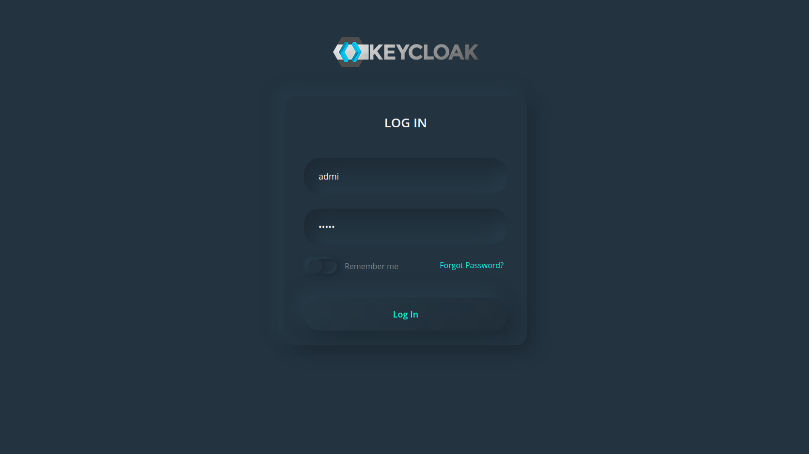
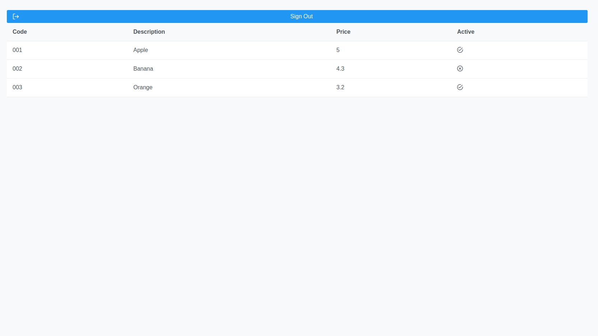

# Description

PoC Outh2/OpenID Frontend React Microservice using Keycloak Templates

## Generate projects

PoC Olive 

## Install some dependencies

npm install react-router-dom --save
npm install react-transition-group --save
npm install keycloak-js --save
npm install axios --save
npm install primereact --save   
npm install primeicons --save
npm install primeflex --save

## Login Process

To check the process we must:

- Start keycloak service inside **poc-olive-keycloak-theme** repo

```shell
docker-compose up
```

- Start Python Back end from **poc-olive-business-python** repo. 

> Check the KEYCLOAK_CLIENT_SECRET_KEY variable in your **settings.py** using the correct one from your keycloak client.

```shell
python3 manage.py runserver
```

- Start Keycloak frontend from **poc-olive-front-react** repo

```shell
npm start
```

- Logout click in the logout button to clean your keycloak session


Custom Keycloak Login View Template



Rect Front Products View

